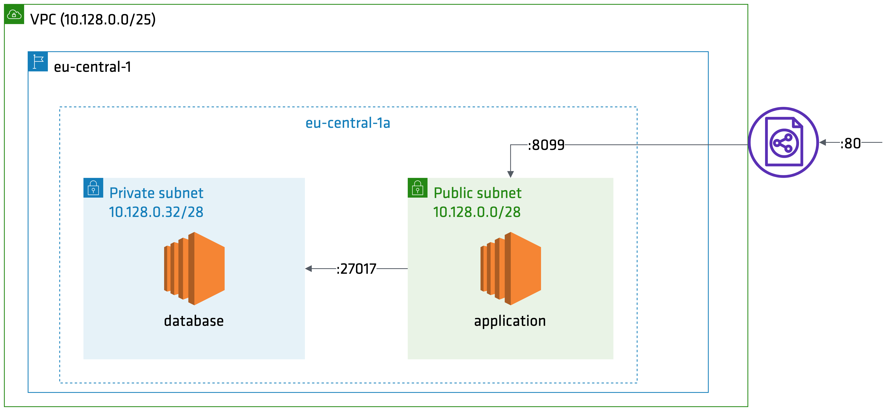

# Example with Terraform / AWS / EC2

This example has a set of tests to create an application
and database in  public and private subnet.

## Pre-Requisites
* [Terraform](https://www.terraform.io/downloads.html) (v0.12.12)
* [Ruby](https://www.ruby-lang.org/en/documentation/installation/) (v2.6.5) & Bundler. Install dependencies with `make install`.
* [conftest](https://github.com/instrumenta/conftest) (v0.18.2+)
* AWS account with IAM & S3 access

## Testing
There are three types of tests:
* unit - run with `make unit`
* contract - set AWS credentials in your shell and run `make contract`
* integration - set AWS credentials in your shell and run `make integration`

## Deploying Infrastructure
1. Set AWS credentials.
1. Run `terraform plan` to dry run.
1. Run `terraform apply` to create the infrastructure.